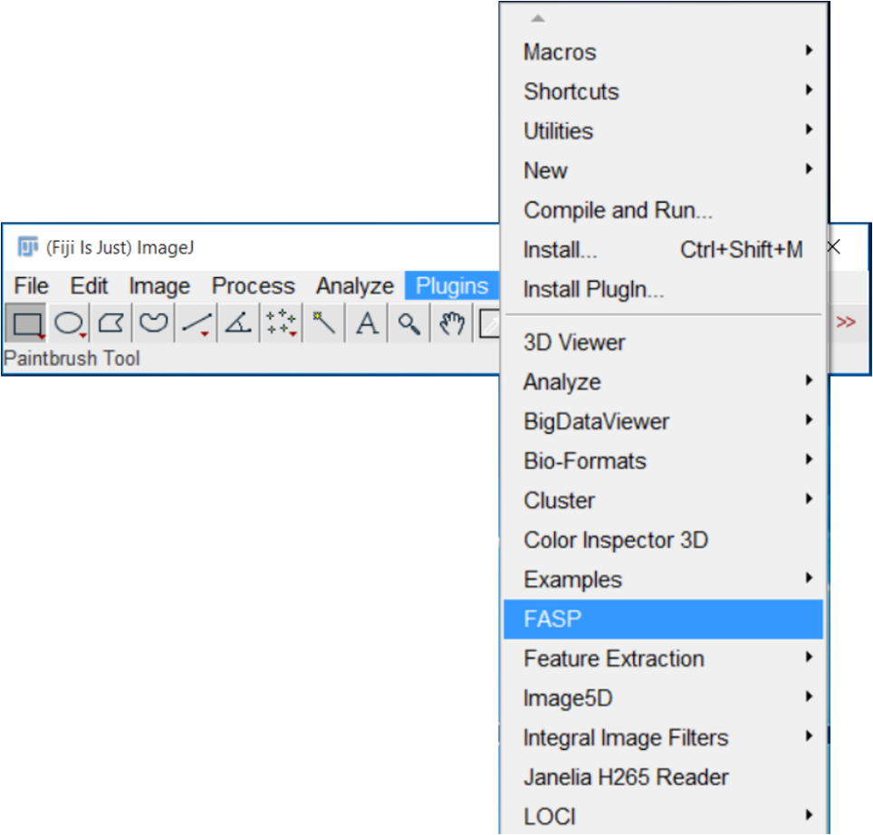
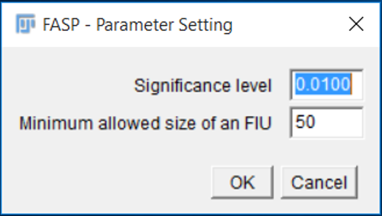
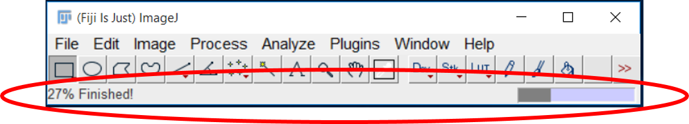
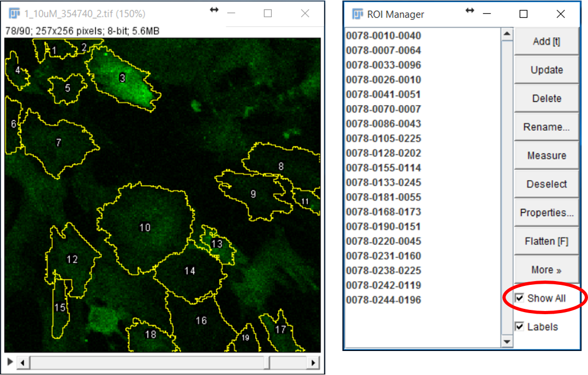
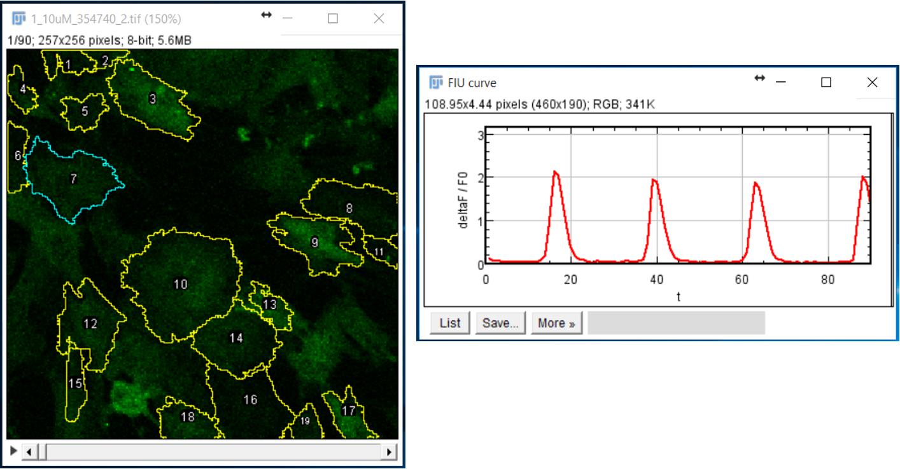
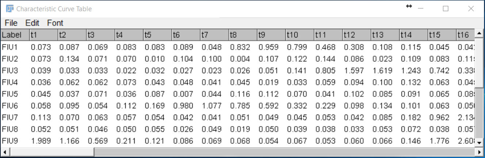
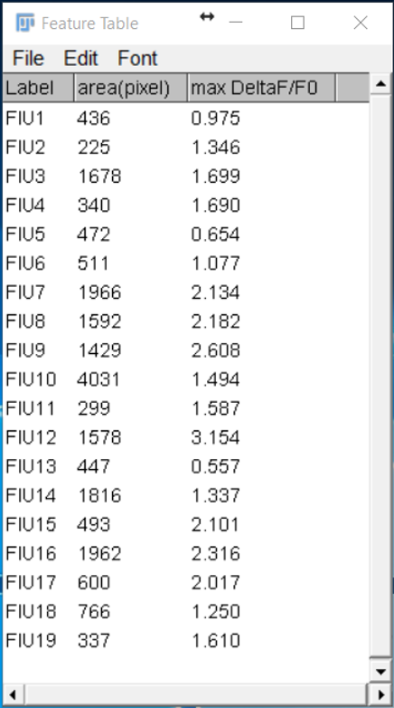
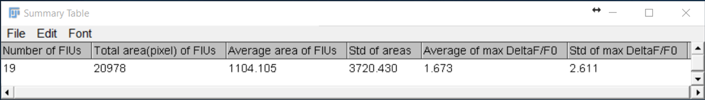
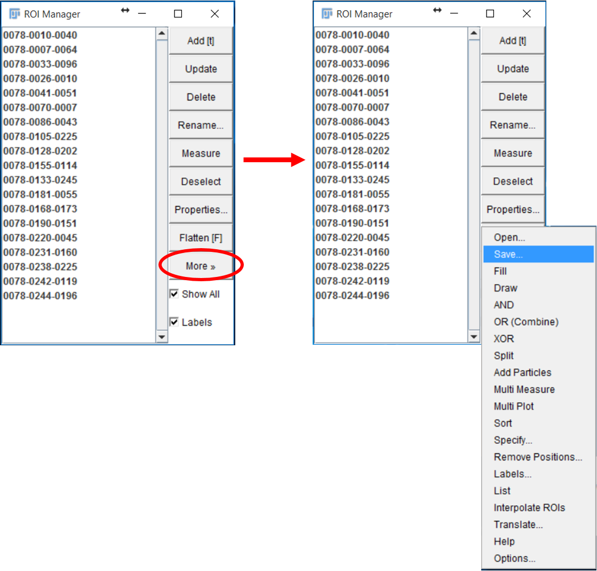
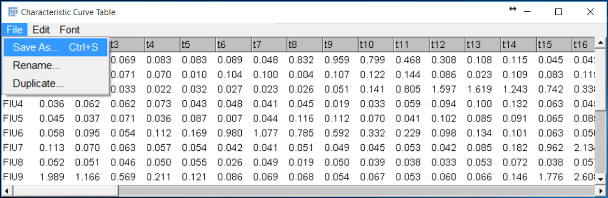

# FASP
Functional AStrocyte Phenotyping (FASP) is a Fiji plugin that automatically analyzes and characterizes the spatiotemporal functional status of astrocytes from time-lapse Ca2+-fluorescence microscopy imaging data. Being totally unsupervised, it automatically detects astrocyte functionally independent units (FIUs), extracts functional features of them, and further characterizes the functional status. 

FASP explicitly models and well handles the intracellular propagation phenomena of astrocytic Ca2+ fluctuations, the major reason why it’s difficult to repurpose the existing methods of neuron spatiotemporal analysis for astrocytes. Besides, considering the complex nature of Ca2+ signaling and low signal to noise ratio, FASP is designed to be data-driven and probabilistically principled, to flexibly account for complex patterns and perform robustly with noisy data. Parameter tuning is purposely designed to be very easy: the only two parameters for users to tune have either probabilistic meaning or physical (scale) meanings.

# How to cite FASP
Wang, Yinxue, et al. "Automated functional analysis of astrocytes from chronic time-lapse calcium imaging data." Frontiers in neuroinformatics 11 (2017): 48.

# Tutorial
## Installation

To install the FASP plugin, simply save or copy it into the folder “\Fiji.app\plugins\”, then call “Help -> Refresh Menus” or restart Fiji/ImageJ. The FASP plugin will become available in Fiji/ImageJ's “Plugins” menu.

<!--  -->

The plugin has been tested and successfully run on ImageJ version ≥ 1.49q. If users encounter problems using older versions of ImageJ, please update your ImageJ to a newer version ≥ 1.49q.

## Input
FASP is designed for single-channel gray-scale time lapse image stack. So far we only support 8-bit or 16-bit images of any file format supported by Fiji/ImageJ. Open the image stack of interest in Fiji/ImageJ. 

<!---->

(Note: Fiji/ImageJ typically provides users with “Lookup Tables” under “Image” menu that can be applied to single-channel grayscale images or image stacks to produce false-color images. Some colors may make manual proofreading easier, such as green color. FASP can be applied to single-channel grayscale image stacks of any false color, and the results will be just shown as overlay on the input false-color image stack.)

## Parameter setting
With the input image stack opened, run FASP from the plugins menu. A dialogue window will occur, allowing users to adjust the input parameters. Suggested values of parameters are given as default in the textboxes. After the parameter setting is done, click “OK”.

<!---->

## Processing procedure
Since FASP is a totally unsupervised algorithm, NO interactive user input is needed while FASP is running. The progress of the program will be shown using a progress bar in the bottom right corner of Fiji/ImageJ toolbar. Besides computing platform, the running time of FASP also depends on the activity level of the imaged cells, the spatiotemporal scales of input image stack, and the minimum allowed size of FIUs.

<!---->

## Outputs
The results are given using tables and the ROI manager of Fiji/ImageJ. All FIUs are circled and labeled on the original image stack. The edges of FIUs are indicated as yellow, and a label is put on each FIU to show the ID of this FIU. If the yellow edges disappear due to some reason/operation, users may reset the edge overlay by checking the checkbox “show all” on the bottom right.

<!---->

If the user is particularly interested in one FIU, she/he can click on the label of the FIU of interest to inspect its characteristic curve (in *ΔF/F_0*). The selected FIU will be highlighted with blue edges on the image stack.

<!---->

Besides, to make it easier for users to save the results, a table is also given containing the characteristic curves (in *ΔF/F_0*) of all FIUs.

<!---->

The basic information of each FIU is listed in a table, including its area (in pixel) and the magnitude (max *ΔF/F_0*) of this characteristic curve.

<!---->

And some overall assessment of the sample is also provided in a summary table.

<!---->

To save the results, the user can use the export/save function of Fiji/ImageJ for ROI manager, images and tables.

<!---->

<!---->

